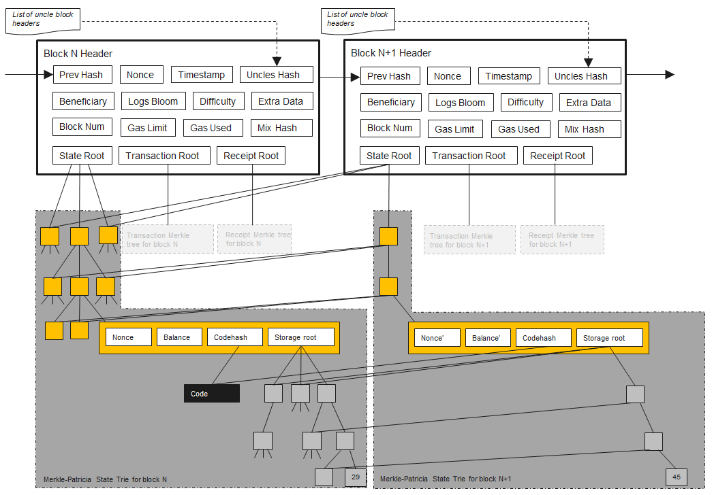

# ETH概览
## 特性

## eth block header
block header数据结构如下, 在这块代码块中,通过注释做了简短的描述.
> https://github.com/ethereum/go-ethereum/core/types/block.go
```go
type header struct {
	ParentHash  common.Hash       `json:"parentHash"`                               // 父区块头的hash
	OmmerHash   *common.Hash      `json:"sha3Uncles"`                               // ommer块 or 叔块相关
	Coinbase    *common.Address   `json:"miner"`                                    // 成功挖到这个区块所得到所有交易费的矿工接收地址
	Root        common.Hash       `json:"stateRoot"        gencodec:"required"`     // 状态树
	TxHash      *common.Hash      `json:"transactionsRoot"`                         // 交易树
	ReceiptHash *common.Hash      `json:"receiptsRoot"`                             // 收据树
	Bloom       types.Bloom       `json:"logsBloom"`                                // 当前区块所有交易收据数据中的可索引信息组成的bloom过滤器
	Difficulty  *big.Int          `json:"difficulty"`                               // 当前区块难度水平量值
	Number      *big.Int          `json:"number"           gencodec:"required"`     // 当前区块的祖先数量
	GasLimit    uint64            `json:"gasLimit"         gencodec:"required"`     // 每个区块的gas开支上限
	GasUsed     uint64            `json:"gasUsed"`                                  // 当前区块初始化时的unix时间戳
	Time        uint64            `json:"timestamp"        gencodec:"required"`     // 当前区块初始化时的时间
	Extra       []byte            `json:"extraData"`                                // 相关任意字节数据,32字节内
	MixDigest   common.Hash       `json:"mixHash"`                                  // 和 nonce 共用 
	Nonce       *types.BlockNonce `json:"nonce"`                                    // 和mixHash一起证明当前区块承载了足够的计算量
	BaseFee     *big.Int          `json:"baseFeePerGas" rlp:"optional"`             
}
```

### Gas
gas与eth上交易的关系相当于汽油与汽车.任何在eth网络上的操作都要消耗gas.
举几个例子🌰:  
1. 添加两个数字需要消耗3gas
2. 获取账户余额需要消耗400gas
3. 发送交易要消耗21,000gas   

#### GasUsed 和 GasPrice
当交易被打包入block时,这个block中消耗掉的gas数量被统计入gasused字段,而交易者需要支付的费用是 gasused * gasprice (gas价格)得出. 以汽油举例,gasused是骑车用掉的燃油量,gasprice是当前的燃油单价.

#### GasLimit
执行合约或转账等操作需要消耗gas,但是无法提前预知`gasUsed`. 带来的风险是,可能遇到恶意或者错误的智能合约无限消耗用户的余额而导致用户发生无法预料的损失.所以用户在交易的时候通过`GasLimit`字段设置允许消耗的上限,来避免遇到不可预期的损失.设定过`GasLimit`的交易最坏情况下只会损失与设定值等量的余额,而正常情况下不管交易是否成功失败,剩余的燃料(gasLimit - gasUsed)都会返还给用户,同理,失败的交易也会产生gas的消耗.
如果`GasLimit`设置的太低,低于实际需要的`gasUsed`,那么交易注定会失败.
> 标准情况下,发送交易要消耗21,000gas,所以转账行为gasLimit可以设置为21,000gas

#### GWEI
但是单纯的gas数目无法让用户得知需要支付多少,需要乘以GWEI
 1GWEI = 0.0000000001ETH

### 状态树
以太坊采用基于账户的模型,这就意味着eth链上要记录每一个用户账户的当前状态信息. 提供这个功能的就是状态树.   
也就意味着,eth要在链上存储全部的数据. 而以太坊中每一个区块大小被限制为了3000万个gas,而目标则是1500万个. 结合目前的gas成本可以得出当前一个区块的最大大小是30,000,000/16 = 1.875MB.[<sup>1</sup>](#refer-anchor-1)这样的大小对于无数参与交易的用户来说显然无法存储下他们的账户数据,eth为了解决这个问题,在状态树内存储用户账户时,只存储了当前区块下余额发生变动的用户,其余未修改节点直接指向前一个区块中的对应节点.  
同时为了能够快速索引到账户信息,引入了名为默克尔前缀数(MPT)的数据结构.  
如图所示:  
  

### 收据树
为了能使交易信息对零知识证明、索引和搜索都是有用的,我们将每个交易执行过程中的一些特定信息编码为交易收据.
### 交易树

### 智能合约
智能合约被开发者打包成一段二进制的代码，传入eth后

### ommer 叔块
### RLP

### stateDB

### 区块同步

### CAP理论

CAP理论中,Consistency(一致性), Availability(可用性), Partition tolerance（分区容错性）, Pow ETH符合其中AP的特性. 
现象上讲:  
* Pow ETH的每一个节点都可以执行交易,所以不会存在因为个别节点宕机导致整个网络不可用的情况, 所以其实现了A.
* 所有的区块链都不接受分区,不接受不可达成超时限后数据不一致,ETH也不例外,所以其实现了 P.
* 但是ETH在新交易发生的过程中,允许所有的节点数据备份有在同一时刻有不一致的情况, 所以其没有实现C.

设计上讲:

## 相关数据结构
### 🌲默克尔树
默克尔树[<sup>2</sup>](#refer-anchor-2)是一种典型的二叉树,其具有一下主要特点:
* 最下面的叶子结点包含存储的数据或其哈希值
* 非叶子节点(包含中间节点和根节点)都是它的两个孩子节点内容的哈希值  
  
//todo
能提供以下功能:  
1. 证明某个集合中存在或不存在某个元素
2. 快速比较大量数据
3. 快速定位修改
4. 零知识证明
### 🌲Patricia Trie树 (patricia 字典树/前缀树)
是一种🌲形结构,利用字符串的公共前缀来减少查询时间.
其提供了在 空间/搜索/插入/删除上,平均和最差O(n)的复杂度. //[tries](http://www.cs.cmu.edu/~fp/courses/15122-f10/lectures/18-tries.pdf).

假设一个标准的 trie树, 每个父节点下提供有有26个子节点(26个英文首字母),且已经塞有数据. 现要查询一个长度为k的字符串要查询.因此在搜索时间上为O(26 * k) = O(k),插入数据有着同样类似的渐进复杂度.这个特性不会随着插入树中字符串的数量改变而改变,而是跟插入数据的长度相关. 对于任何长度为k的字符串,其渐进复杂度应该为 O(log(26) * k) = O(k).

性质:
1. 从根节点到某一节点,路径上经过的字符连接起来,为该节点对应的字符串.
2. 每个节点的所有自节点包含的字符都不相同
3. 相比trie树非根节点只能存储字符, 可以存储字符串,可以被认为是针对trie做了路径压缩.  


### 🌲MPT(Merkle Paricia Tree) 默克尔前缀树[<sup>3</sup>](#refer-anchor-3)
当我们以单纯的trie tree存储eth的状态树为例,key值为用户的公钥钱包,其值为一个64位长度(32字节),所以该树最深的深度为64.而树中每个节点必须存储32字节,那么一个key就要消耗掉 (32 * 64) = 2048 = 2KB,同时其余分支大概率会是空白字段和大量的移动操作节点.因此在经常变更的eth上,必须要经过优化,达到提高效率,降低深度和减少IO次数的需求.

eth中的MPT定义在 //trie/node.go 路径下。
```go
type node interface {
	cache() (hashNode, bool)
	encode(w rlp.EncoderBuffer)
	fstring(string) string
}

type (
	fullNode struct {
		Children [17]node // Actual trie node data to encode/decode (needs custom encoder)
		flags    nodeFlag
	}
	shortNode struct {
		Key   []byte
		Val   node
		flags nodeFlag
	}
	hashNode  []byte
	valueNode []byte
)

// nilValueNode is used when collapsing internal trie nodes for hashing, since
// unset children need to serialize correctly.
var nilValueNode = valueNode(nil)
```
* fullNode: 分支节点,`fullNode[16]`存储的是`valueNode`.
* shortNode: 叶子节点或者扩展节点，当 shortNode.Key的末尾字节是终止符 16 时表示为叶子节点. 当 shortNode 是叶子节点是，Val 是 valueNode.
* hashNode: 应该取名为 collapsedNode 折叠节点更合适些，但因为其值是一个哈希值当做指针使用，所以取名 hashNode.使用这个哈希值可以从数据库读取节点数据展开节点.
* valueNode: 数据节点，实际的业务数据值，严格来说他不属于树中的节点，它只存在于 fullNode.Children 或者 shortNode.Val 中.

//TODO: 分支节点

### bloom 过滤器

## 挖矿

## 应用

## 参考
> <div id="refer-anchor-1"></div> 
- [1] [Ethereum’s New 1MB Blocksize Limit](https://blog.bitmex.com/ethereums-new-1mb-blocksize-limit/) 
> <div id="refer-anchor-2"></div> 
- [2] [Merkle 树结构](https://yeasy.gitbook.io/blockchain_guide/05_crypto/merkle_trie)
> <div id="refer-anchor-3"></div> 
- [3] [详解以太坊默克尔压缩前缀树-MPT](https://learnblockchain.cn/books/geth/part3/mpt.html)

## 文档待解决问题:
1. eth block中的三大树是怎么落盘的
2. eth block中的三大树在哪里放置了bloom过滤器方便用户查询,还是说没有
3. 查询交易,发起转账的具体流程
4. 智能合约怎么存储的,怎么执行的,有什么特点
5. 文档信息过于碎片化