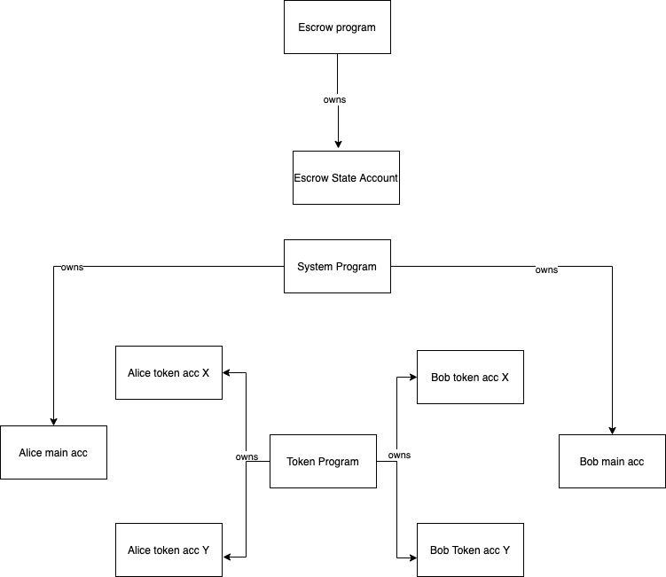
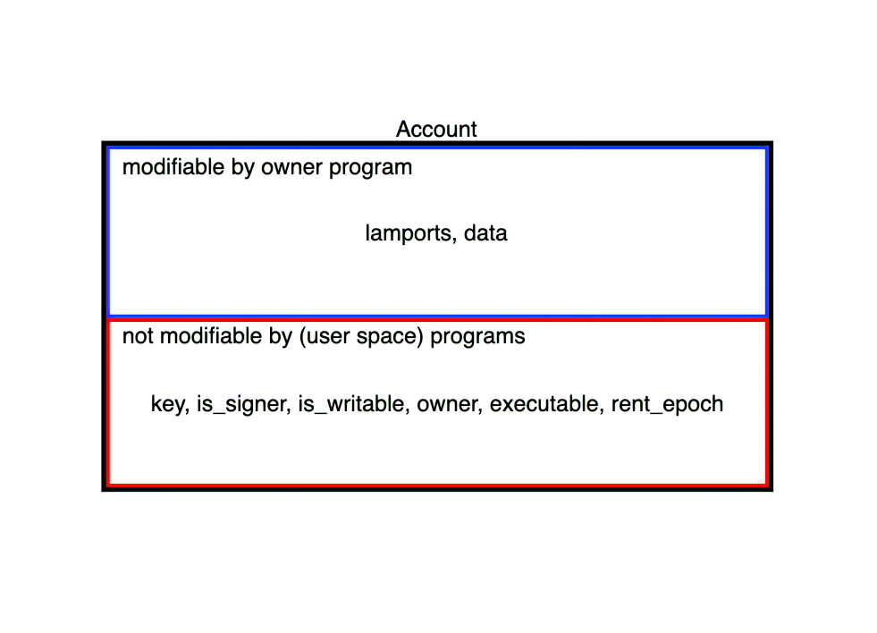
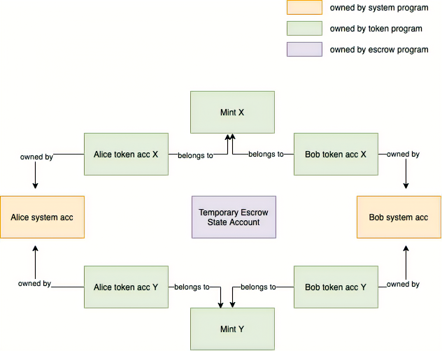
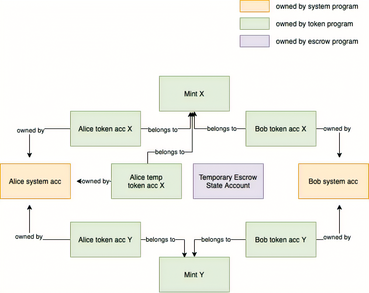

# Solana合约开发指北
这里假定solana需要的开发环境: rust/node.js甚至Solana客户端都已经装好了.  

合约是什么?简单来说,就是在提供多个函数rpc调用后,用户输入符合特定需求的结构体数据后,获得预期的结果或者符合规则的错误.同时提供在可接受的复杂度范围内,存储少量有关用户的元数据.  
> On Solana, smart contracts are called programs  

首先,先确定solana的相关术语.为了符合官方的称谓,solana上的智能合约都被称作programs而非smart contracts.  
随后,我们预想一个智能能合约案例,来展开描述在solana上开发智能合约要处理哪些细节.

## Example Escrow
Alice持有token X, Bob持有token Y,他们互相之间达成了交易约定: Alice 支付100X,和Bob手里50Y进行兑换.和我们购物使用淘宝一样,Alice和Bob都害怕交钱不发,所以需要一个能充当支付宝的智能合作作为一个可信赖的第三方托管,这就是我们案例: Escrow.


直观的去想,让Alice发起交易的时候转账给合约就行,让Bob后续去找合约拿钱.但这是传统支付宝的做法:支付宝拥有一个巨大的数据库,可以通过键值的方式记录下不同数以亿计的用户的交易对.在solana上,智能合约的数据存储是通过account来实现的,而每一个account最多只能提供32KB的数据存储,无法存储跟合约无关的用户数据.  

solana并不是没有预见到这点,其提供的PDA(程序委托账户)能代我们做到记录无限的数据账户--当用户与合约交易时,为其生成专属的account来存储交易细节.当Alice和智能合约互动的时候, 智能合约通过确定的种子生成一个PDA账户来处理这笔交易.

```mermaid
graph LR:
    Alice -> 
```
让我们展开,一点点的捋下实现细节.
<!--  -->

## Setting up the project
我们可以参照这个[案例](https://github.com/mvines/solana-bpf-program-template)创建一个rust的项目,我们修改`Cargo.toml`,让其知道我们需要的依赖和编译结果产出.
```toml
[package]
name = "solana-escrow"
version = "0.1.0"
edition = "2021"
license = "WTFPL"
publish = false

[dependencies]
solana-program = "1.9.4"

[lib]
crate-type = ["cdylib", "lib"]
```

## entrypoint.rs, program, and accounts
现在我们已经在着手编写这个智能合约了!如我们所见,最后编译成eBPF的程序,入口处在`lib.rs`中,我们通过`use`来引入任何被导入的函数,通过`entrypoint!`这个宏来定义`process_instruction`函数.这是唯一调用智能合约的方法,所有的合约调用都是通过entrypoint来触发.

> 被调用的时候, program被传递给BPF Loader. 不同的BPF Loader需要不同的entrypoint  

这里我们创建了`entrypoint.rs`,用来设置程序的入口
```rs
use solana_program::{entrypoint, entrypoint::ProgramResult, pubkey::Pubkey, account_info::AccountInfo};

use crate::process::Processor;

entrypoint!(process_instruction);
fn process_instruction(
    program_id: &Pubkey,
    accounts: &[AccountInfo],
    instruction_data: &[u8],
) -> ProgramResult {
    Processor::process(program_id, accounts, instruction_data)
}
```
`process_instruction`作为入口函数,我们看到其接受了三个入参. `program_id`是这个program的地址,在后面会解释为什么要在程序内部访问它. `instruction_data`是调用者传递给程序的数据,可以是任何数据. 而`accounts`数组,则和solana的编程模型密切关联.我门需要account的原因是:
> solana program 是无状态的  

如果我们想要存储状态,就需要使用账户. 我们的program本身存储在账户中,其被标记为可以被执行.账户可以保存数据和sol代币.每个账户有一个所有者,这个所有者可以对账户扣款或者调整其中对数据.

> accounts 只能被 program 所有  

这个时候你会意识到: 你自己的sol账户实际上并不属于你. 但此时,你的资金仍然是[安全的](https://www.urbandictionary.com/define.php?term=Safu). 因为所有的sol交易都是由`system program`处理的.事实上,程序也是由程序所有.程序被存储在账户之中,这些可执行账户被`BPF Loader`所有. 唯一不属于`BPF Loader`的是, `BPF Loader` 和 `system program`.他们是`NativeLoader`的门徒,并拥有特殊权限,比如分配内存,标记账户为可执行.

> 理论上，程序对其拥有的账户有完全的自主权。由程序的创建者来限制这种自主权，并由程序的用户来验证程序的创建者是否真的这样做了。 
> 所有要读取或写入的账户都必须传入entrypoint函数中

这允许运行时将事务并行化。如果运行时知道所有将被写入和被每个人在任何时候读取的账户，它可以并行运行那些不接触相同账户的事务，或者接触相同账户但只读不写。如果一个事务违反了这一约束，向一个运行时没有被通知的账户读或写，那么该事务将失败。

现在，为了最后结束本节，在lib.rs旁边创建一个新的entrypoint.rs文件，并将lib.rs的代码移到那里。最后，在lib.rs内注册entrypoint模块。你必须对我们创建的所有文件都这样做。

theory recap 📚  
each program is processed by its BPF Loader and has an entrypoint whose structure depends on which BPF Loader is used
accounts are used to store state
accounts are owned by programs
only the account owner may debit an account and adjust its data
all accounts to be written to or read must be passed into the entrypoint

## Alice’s transaction
### instruction
前一段中我们创建了`entrypoint.rs`,描述了程序的入口,现在我们创建`instruction.rs`,来为程序实现API.
为了首先有个总体印象,我们先看一下solana 的program结构:

```
.
├─ src
│  ├─ lib.rs -> registering modules
│  ├─ entrypoint.rs -> entrypoint to the program
│  ├─ instruction.rs -> program API, (de)serializing instruction data
│  ├─ processor.rs -> program logic
│  ├─ state.rs -> program objects, (de)serializing state
│  ├─ error.rs -> program specific errors
├─ .gitignore
├─ Cargo.lock
├─ Cargo.toml
├─ Xargo.toml
```

描述流程的话是这样的:  
1. 用户调用entrypoint
2. entrypoint转发参数到processor
3. processor 要求 instruction解码entrypoint传入的instruction_data
4. 使用被解码的数据,processor会决定用什么函数处理请求
5. processor可以使用state.rs将状态编码到已传入entrypoint的账户中，或对账户的状态进行解码。

核心是:
> instruction.rs defines the "API" of a program

回到escrow

Alice和Bob的主账户都是`system_program`的账户,而他们想交易的token,由`token program`创建.他们要持有token,就需要拥有由`token program`创建的账户. Alice和Bob都需要持有对方要交易的token的特别账户才能完成交易,所以在Alice和Bob的交易对中,我们至少要有4个账户.


### token ownership && transfer ownership
如果为了执行交易,Alice和Bob都持有不同的token账户,记住不同的token密钥去执行交易,未免太过繁琐.solana的代币程序规避了这种方式: token(代币)账户的所有者只能是program本身,而token本身的所有者,诸如alice还有Bob等用户,则是program在用户空间声明的数据,数据被编码在代币账户中,此外还有[其他属性](https://github.com/solana-labs/solana-program-library/blob/80e29ef6b9a081d457849a2ca42db50d7da0e37e/token/program/src/state.rs#L86),如账户持有的代币余额. 所有,后续会将token的所有者被称为`authority`,而solana内部的token所有者被称为`owner`.这其实揭示了solana的token所有权机制:

> All internal Solana internal account information are saved into fields on the account (opens new window)but never into the data field which is solely meant for user space information
> 所有Solana内部账户的信息都被保存在账户的字段中（打开新窗口），但绝不会保存在数据字段中，因为数据字段只用于用户空间信息  
> 

下图简单的描述了 “用户空间” 中token的所有权.

Alice为了使用一部分token与Bob进行交易,她创建了一个关于X token的临时账户,并向其转移交易量的token,随后她调用token program中的函数,将这个临时的所有权转移到了托管程序中.而这个托管程序,就是后面要涉及到的合约为其生成的PDA.


### 继续回到 Instruction
```rs
// inside instruction.rs
pub enum EscrowInstruction {

    /// Starts the trade by creating and populating an escrow account and transferring ownership of the given temp token account to the PDA
    ///
    ///
    /// Accounts expected:
    ///
    /// 0. `[signer]` The account of the person initializing the escrow
    /// 1. `[writable]` Temporary token account that should be created prior to this instruction and owned by the initializer
    /// 2. `[]` The initializer's token account for the token they will receive should the trade go through
    /// 3. `[writable]` The escrow account, it will hold all necessary info about the trade.
    /// 4. `[]` The rent sysvar
    /// 5. `[]` The token program
    InitEscrow {
        /// The amount party A expects to receive of token Y
        amount: u64
    }
}
```

回到instruction,我们先添加第一个指令.通过这个指令,Alice可以初始化她想执行的交易.

注意,`///`这种注释不会影响到代码. `writable`标志意味着,调用会尝试写账户,如果失败了那么交易会失败.

设: Alice发起交易存入token X并设置需要的token Y数量, 稍后Bob会拿token Y去执行交易
那么, Alice首先调用 InitEscrow,这条指令期待的Accounts就如下所示: 
0. `[signer]` 被用来交易持有token所有权的临时账户,其需要Alice的签名,所以这是Alice的地址,声明了签名人是谁
1. 需要被写入的 temp token X account
2. alice‘s token Y account
3. 一个可写的escrow account
4. rent sysvar 租金账户变量
5. token program

随后我们实现instruction对instruction_data的解码操作:
```rs
// inside instruction.rs
use std::convert::TryInto;
use solana_program::program_error::ProgramError;

use crate::error::EscrowError::InvalidInstruction;

 pub enum EscrowInstruction {
    InitEscrow {
        /// The amount party A expects to receive of token Y
        amount: u64
    }
}

impl EscrowInstruction {
    /// Unpacks a byte buffer into a [EscrowInstruction](enum.EscrowInstruction.html).
    pub fn unpack(input: &[u8]) -> Result<Self, ProgramError> {
        let (tag, rest) = input.split_first().ok_or(InvalidInstruction)?;

        Ok(match tag {
            0 => Self::InitEscrow {
                amount: Self::unpack_amount(rest)?,
            },
            _ => return Err(InvalidInstruction.into()),
        })
    }

    fn unpack_amount(input: &[u8]) -> Result<u64, ProgramError> {
        let amount = input
            .get(..8)
            .and_then(|slice| slice.try_into().ok())
            .map(u64::from_le_bytes)
            .ok_or(InvalidInstruction)?;
        Ok(amount)
    }
}
```
`unpack`[实现](https://doc.rust-lang.org/stable/book/ch04-02-references-and-borrowing.html)了解析&[u8] (一个被引用的u8数组).这里,u8数组的第一个byte被用来作为tag去识别类型. `unpack_amount`这里用来获得结构体中的amount具体金额,其代表了Alice想要获得的token Y数量.
### process.rs
能解析用户调用数据后,我们开始编写processor,来实现合约操作.
```rs
use solana_program::{
    account_info::AccountInfo,
    entrypoint::ProgramResult,
    msg,
    pubkey::Pubkey,
};

use crate::instruction::EscrowInstruction;

pub struct Processor;
impl Processor {
    pub fn process(program_id: &Pubkey, accounts: &[AccountInfo], instruction_data: &[u8]) -> ProgramResult {
        let instruction = EscrowInstruction::unpack(instruction_data)?;

        match instruction {
            EscrowInstruction::InitEscrow { amount } => {
                msg!("Instruction: InitEscrow"); //日志信息
                Self::process_init_escrow(accounts, amount, program_id)
            }
        }
    }
}
```
这段代码逻辑比较简单,在接受到指令后,解析成数据,执行对应的processer.


### fn process_init_escrow
⚠️前方大量代码警告⚠️  
Don't Panic, 我会在注释里面讲清楚
```rs
use solana_program::{
    account_info::{next_account_info, AccountInfo},
    entrypoint::ProgramResult,
    program_error::ProgramError,
    msg,
    pubkey::Pubkey,
};
...
 fn process_init_escrow(
        accounts: &[AccountInfo],
        amount: u64,
        program_id: &Pubkey,
    ) -> ProgramResult {
        let account_info_iter = &mut accounts.iter(); ///开启账户迭代器! 设置为mutable是为了可以移动账户的所有权
        let initializer = next_account_info(account_info_iter)?; 

        //Alice main account,在这笔交易中,她需要是一个signer
        if !initializer.is_signer {
            return Err(ProgramError::MissingRequiredSignature);
        }

        let temp_token_account = next_account_info(account_info_iter)?;
        let token_to_receive_account = next_account_info(account_info_iter)?;
        // Q: "why do we check that the token_to_receive_account is actually owned by the token program but don't do the same for the temp_token_account?".
        // Q: 为什么要检查token_to_receive_account是否真的为token程序所有?而不是对temp_token_account做同样的检查?
        // A: 在函数的后面，我们将要求令牌程序将temp_token_account的所有权转移给PDA。如果temp_token_account不属于token程序，那么这个转移就会失败，
        // 只有账户的拥有者可以修改账户
        if *token_to_receive_account.owner != spl_token::id() {
            return Err(ProgramError::IncorrectProgramId);
        }

        // 
        let escrow_account = next_account_info(account_info_iter)?;
        let rent = &Rent::from_account_info(next_account_info(account_info_iter)?)?;

        // 免租租金
        if !rent.is_exempt(escrow_account.lamports(), escrow_account.data_len()) {
            return Err(EscrowError::NotRentExempt.into());
        }

        let mut escrow_info = Escrow::unpack_unchecked(&escrow_account.try_borrow_data()?)?;
        if escrow_info.is_initialized() {
            return Err(ProgramError::AccountAlreadyInitialized);
        }

        escrow_info.expected_amount = amount;
        Escrow::pack(escrow_info, &mut escrow_account.try_borrow_mut_data()?)?;
        let (pda, _bump_seed) = Pubkey::find_program_address(&[b"escrow"], program_id);

        let token_program = next_account_info(account_info_iter)?;
        let owner_change_ix = spl_token::instruction::set_authority(
            token_program.key,
            temp_token_account.key,
            Some(&pda),
            AuthorityType::AccountOwner,
            initializer.key,
            &[&initializer.key],
        )?;

        invoke(
            &owner_change_ix,
            &[
                temp_token_account.clone(),
                initializer.clone(),
                token_program.clone(),
            ],
        )?;

        Ok(())
    }
```

`rent`sysvar出现在了process的过程中.
> Rent is deducted from an account's balance according to their space requirements (i.e. the space an account and its fields take up in memory) regularly. An account can, however, be made rent-exempt if its balance is higher than some threshold that depends on the space it's consuming

Alice转账过程中开了个账户,在租金上不是免租的,她以此向Bob发起了交易. Bob当时没有收取,十年后,Alice向Bob发送的1000个X token现在能换十个亿了,Bob想起来自己有个暴富的机会决定去收取,但是账户因为租金不是免租的,被solana系统干掉了.   
这合理吗?这不合理.  
更何况,现在租金几乎是两到三天一收(epoch),如果不是免租的,很快就会这样意外的burn掉了token,这是不可预期的错误行为. 所以为了交易的安全,alice必须向这个账户存够能让其免租的sol/lamports.


最后记得
```toml
[dependencies]
solana-program = "1.9.4"
spl-token = {version = "3.2.0", features = ["no-entrypoint"]}
```

### error.rs
```toml
...
[dependencies]
solana-program = "1.9.4"
spl-token = {version = "3.2.0", features = ["no-entrypoint"]}
thiserror = "1.0.24"
```

```rs
// inside error.rs
use thiserror::Error;

use solana_program::program_error::ProgramError;

#[derive(Error, Debug, Copy, Clone)]
pub enum EscrowError {
    /// Invalid instruction
    #[error("Invalid Instruction")]
    InvalidInstruction,
}

impl From<EscrowError> for ProgramError {
    fn from(e: EscrowError) -> Self {
        ProgramError::Custom(e as u32)
    }
}
```
### state.rs
```rs
use solana_program::pubkey::Pubkey;

pub struct Escrow {
    pub is_initialized: bool,
    pub initializer_pubkey: Pubkey,
    pub temp_token_account_pubkey: Pubkey,
    pub initializer_token_to_receive_account_pubkey: Pubkey,
    pub expected_amount: u64,
}
```

### CPIs

### Program Derived Address PDAs

## Bob‘s Transaction

## Anchor
走完上面的流程,是不是感受到了粗陋和繁琐?  
传输数据用的是最基本的Accounts数组/u8数组,为了拿到数据,我们要通过计算数据的长度,一个个取出来并强壮,这看起来并不像是现代人会干的事情.  
所以这里介绍一下Anchor,其将之前繁琐步骤中不断重复的绝大多数都用宏做了化简,来降低我们可怜的1500ml左右的的脑浆上的心智负担.
### Anchor install
###

## 参考
1. [Programming on Solana - An Introduction](https://paulx.dev/blog/2021/01/14/programming-on-solana-an-introduction/#processor-part-2-pdas-part-2-cpis-part-1)