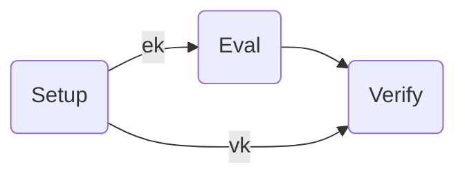

# 可验证延迟函数VDF
VDF已经被应用到了chia币的proof-of-space,也被预计被更新为pos验证机制的eth2.0引入.

## 简介
VDF 是一类数学函数，能够使得该函数的计算需要至少一段已知的时间，即使是在同时使用少量 CPU 进行并行计算的情况下.
VDF满足以下性质:
1. VDF的结果验证非常有效率
2. 唯一性: 对于任意给定的输入,产生能够通过检验的唯一结果.
3. 串行性: 计算vdf在工作者花费了时间t的情况下产生的结果,攻击者能够使用任何计算方法在少于t的时间内计算出来的概率可以小到忽略不计.

## 特性
VDF是三个算法组成的三元组函数.(Setup, Eval, Verify).

## 🌰:

## 参考
[1] [可验证延迟函数（VDF）（一）一文搞懂 VDF](https://blog.priewienv.me/post/verifiable-delay-function-1/)